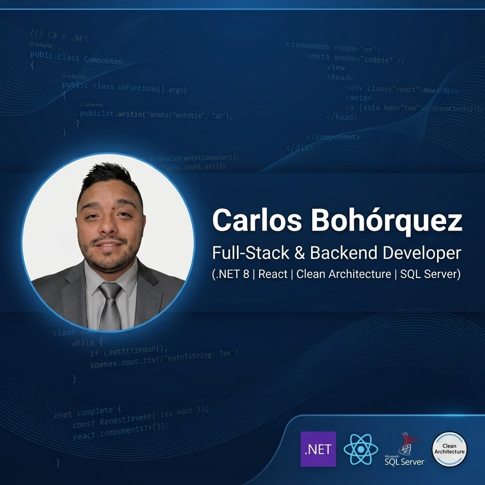

  

    
  <h2>👨‍💻 Full-Stack & Backend Developer (.NET / React)</h2>
  
Especializado en <b>Clean Architecture</b>, <b>CQRS</b>, <b>.NET 8</b> y desarrollo web con <b>React</b>

---

### 📌 Sobre mí

- 🚀 Desarrollador de software enfocado en construir APIs RESTful escalables, seguras y de alto rendimiento.
- 🏛️ Apasionado por la **Clean Architecture**, patrones de diseño (**CQRS, Repository Pattern**) y buenas prácticas de desarrollo.
- 🧪 Experiencia implementando pruebas unitarias e integración (**xUnit, NUnit, Moq**).
- 📍 Ubicado en **Colombia 🇨🇴**.

### 📬 Contacto

  
  

---

### 🔥 Proyecto Destacado: AppDrugs (Sistema de Gestión Farmacéutica)

> **AppDrugs** is una solución Full-Stack enterprise para la gestión integral de inventarios de medicamentos, control de stock, caducidad, autenticación por roles y validación de turnos mediante códigos QR.

👉 **[Ver Repositorio del Proyecto](https://github.com/bohorquezc734/AppDrugsV2)**

#### 🛠️ Arquitectura y Tecnologías
- **Backend (.NET 8):** Construido bajo **Clean Architecture** en 4 capas (Domain, Application, Infrastructure, API).
- **Patrón CQRS:** Implementado con **MediatR** para la separación clara de comandos y consultas.
- **Base de Datos:** **SQL Server** mapeado con **Entity Framework Core 8**.
- **Seguridad:** Autenticación **JWT**, contraseñas hasheadas con **BCrypt** y validación de datos con **FluentValidation**.
- **Frontend:** Desarrollo SPA interactivo con **React**, **TypeScript** y consumo de APIs REST.
- **Documentación & Logs:** **Swagger / OpenAPI** y logging estructurado con **Serilog**.

---

### 🛠️ Stack Tecnológico

#### **Backend & Base de Datos**

  
  
  
  
  

#### **Frontend**

  
  
  
  
  

#### **Testing & Calidad**

  
  
  

#### **Herramientas & Control de Versiones**

  
  
  
  
  

---

### 📊 Estadísticas de GitHub

  
  

